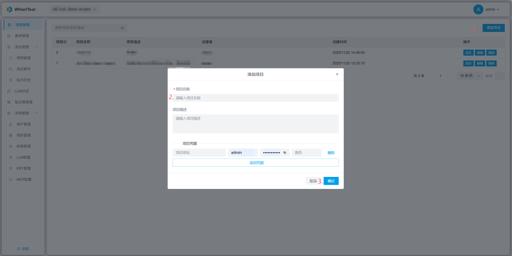
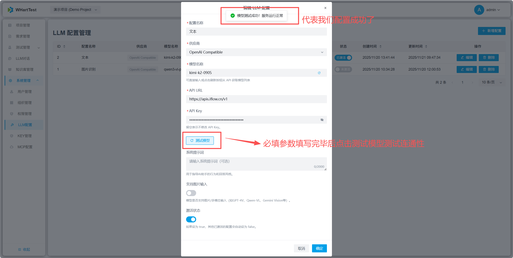
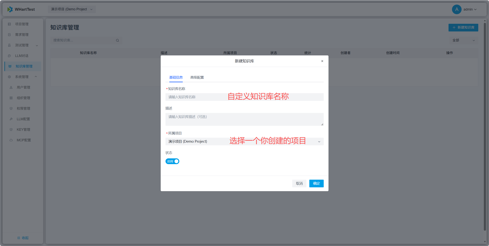
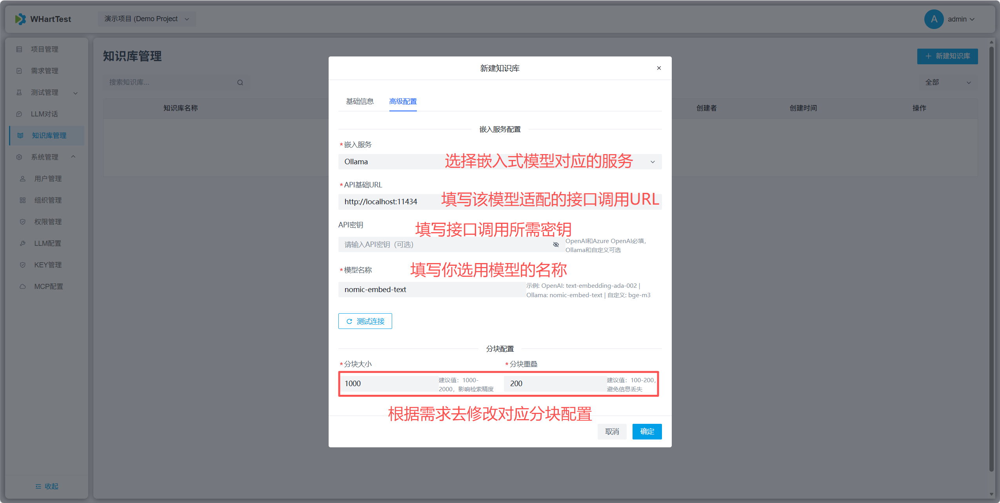
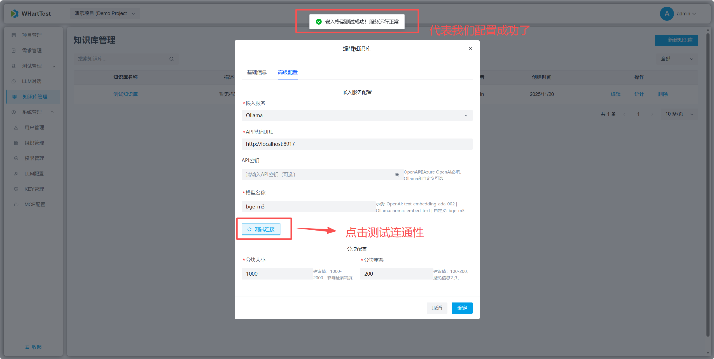
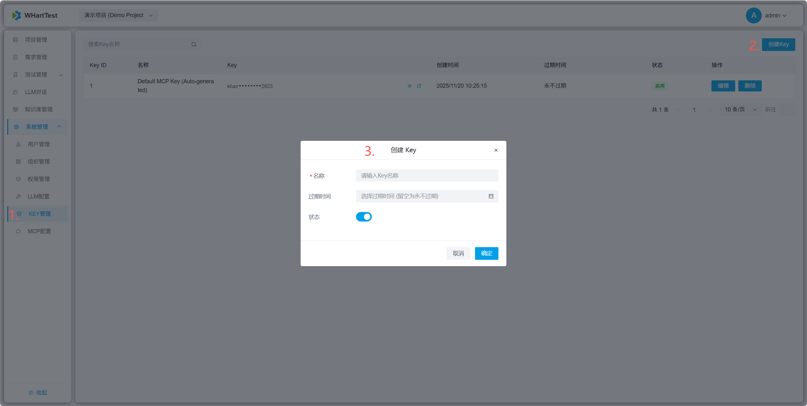
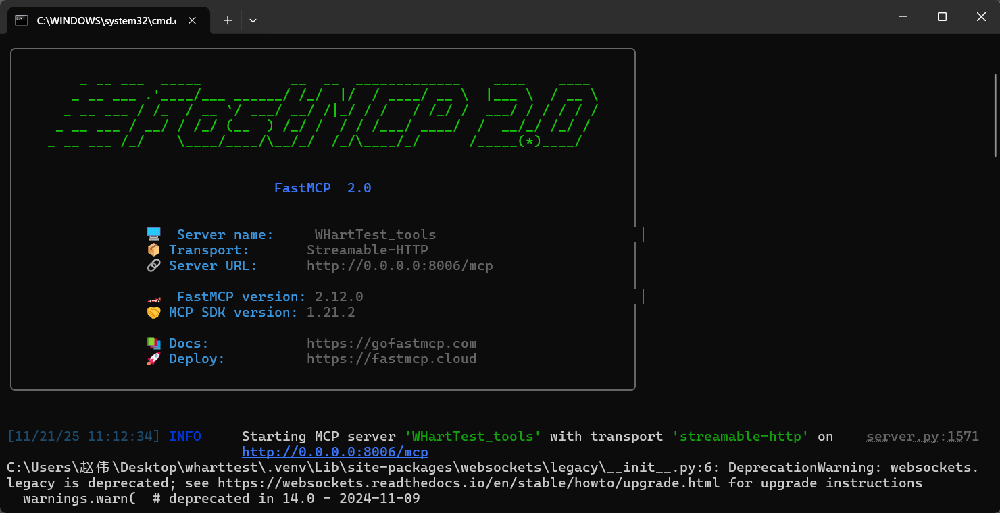
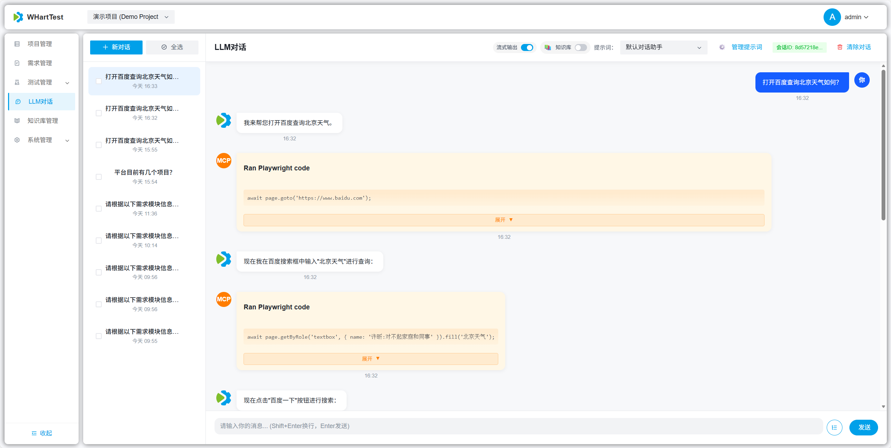
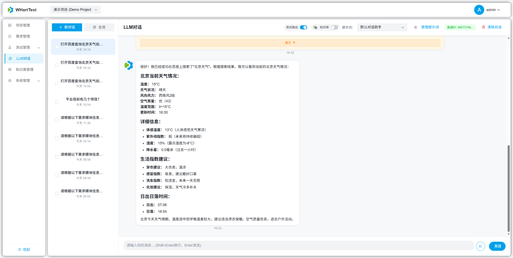
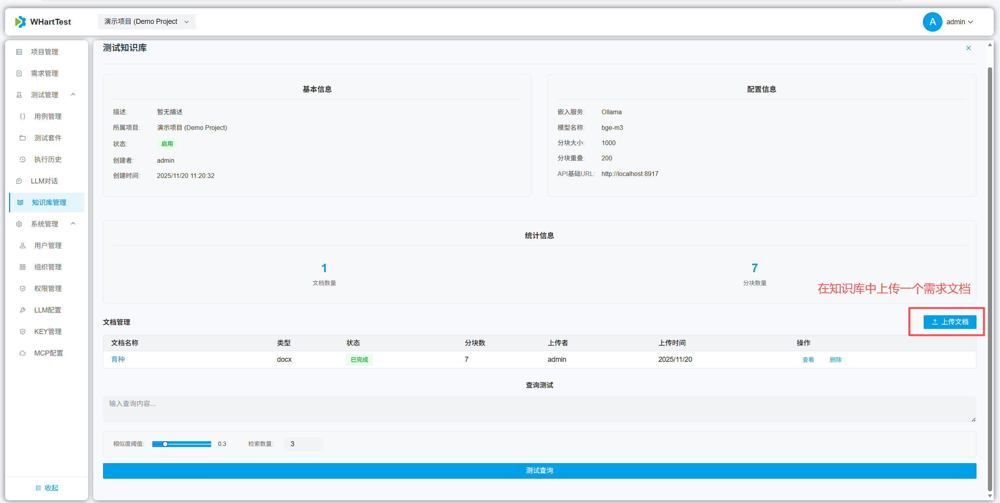

# 配置流程


## 一、创建项目
首先让我们先创建一个项目



## 二、LLM配置示例
1.配置界面


若尚未接入大语言模型服务，推荐使用 心流开放平台（https://platform.iflow.cn/）免费获取主流模型（如 Qwen3 Coder、Kimi K2、GLM-4.5 等）的 API 接入参数，包括 API Base URL、API Key 和模型标识符。


2.测试连通性



## 三、知识库配置示例
1.向量模型配置
- 已有云端向量模型服务

如果您已接入可用的云端向量模型服务（如阿里云百炼、腾讯混元、Azure AI 等），直接进入 「配置知识库」 环节，在配置中填写服务地址、API Key 及模型名称即可。

- 无云端向量模型服务，可采用开源向量模型 bge-m3

（1）本地部署方式运行：请依次执行以下命令：

```bash
docker-compose up -d bge-m3
docker-compose up -d bge-m3-init
```

（2）Docker 部署方式：直接启动相应的 Docker 服务并进行配置即可。


2.配置知识库




3.测试连通性



## 四、MCP配置示例
### 前置：前往key管理生成key
- 平台内置了key，如果不考虑安全问题使用即可

- 如果考虑安全问题可以采用下方的步骤创建一个自己的key进行替换

1.创建key



2.复制key


3.替换key


### 配置MCP
1.本地部署运行下方命令启动mcp服务
```bash
uv run python WHartTest_tools.py
```



2.配置示例


3.测试连通性


## 五、验证上述配置是否配置成功
1.对话询问平台有多少个项目


2.对话询问打开百度查询北京今天的天气预报




3.在知识库中上传一个需求文档，对话询问文档中需求具体内容



总结：上述三个问题对话输出都正确说明你的配置完全没有问题！
