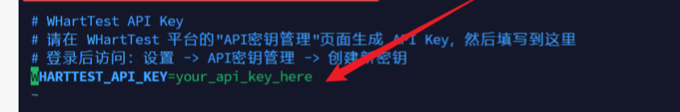
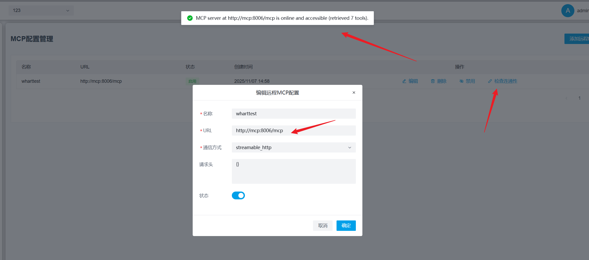
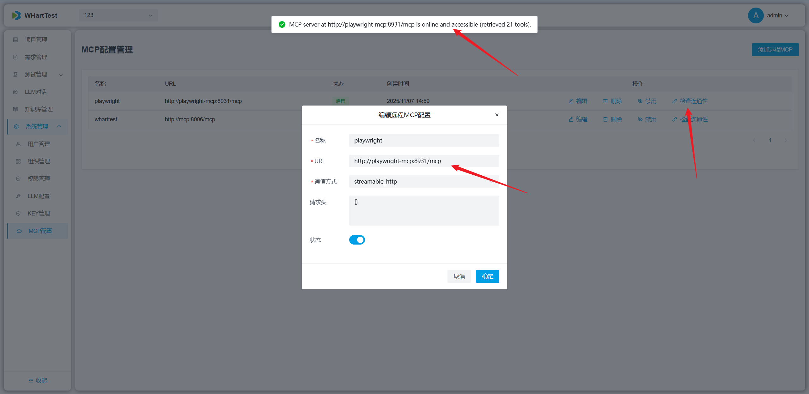

## 问题一：是否有免费的大模型地址？
回答：使用心流的key，免费https://platform.iflow.cn/cli/quickstart
## 问题二：镜像下载太慢，怎么办？
回答：在docker-compose.yml更换国内镜像下载地址
## 问题三：如何访问前端容器？
回答：http://localhost:8913
## 问题四：docker部署MCP服务后.env文件需要改吗
回答：运行起来后在平台创建一个key并复制在项目目录WHartTest_MCP下的.env文件中进行替换key
## 问题五：需求评审处理失败，是api连接的问题导致的吗？
回答：1.检查LLM配置测试连通性2.检查MCP配置测试连通性3.检查知识库配置测试连通性
## 问题六：本地mcp怎么运行？
回答：替换WHartTest_MCP下的.env文件中的key运行WHartTest_MCP\WHartTest_tools.py
## 问题七：评审通过，点击生成用例则新产生一个对话，但是对话没回应
回答：1.检查LLM配置是否正确2.检查MCP配置是否正确
## 问题八：本地执行用例报错
回答：除了平台MCP需要配置，还需要配置playwright-MCP
## 问题九：平台的mcp 和 playwright的mcp 有什么区别？
回答：参考 https://developer.aliyun.com/article/1665090
## 问题十：对话提示缺少ui自动化能力
回答：需要配置playwright-MCP
## 问题十一：大模型提示词在哪里？
回答：系统有默认的提示词，在LLM对话的右上角
## 问题十二：在运行playwright mcp时候，怎么让它有头运行？
回答：参考官方文档：https://github.com/microsoft/playwright-mcp
## 问题十三：生成的用例如何自动保存
回答：1.先创建一个key复制出来

2.修改env文件这里，重启mcp容器

3.按照下图配置即可

## 问题十四：mcp服务对应的.env中的后端url修改成本机ip测试连接失败
回答：需修改成127.0.0.1，重启mcp服务并新开对话测试